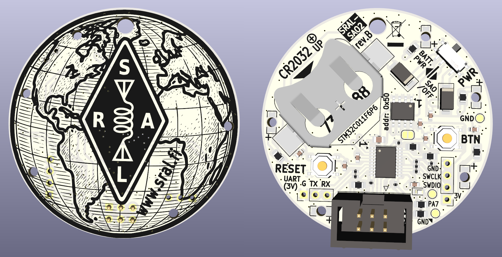

# SRAL-SAO2-basefw



SRAL-SAO2 is a non-commercial electronic badge / Simple AddOn (SAO V1.69bis) for a badge, based on STM32C011F6 32-bit MCU (up to 48MHz, 32kB flash, 6kB RAM). These devices (a small batch of them) were awarded as prizes to those who succesfully solved the [SRAL](https://www.sral.fi) "Antenna Controller" CTF challenge at the Disobey 2026 event (Helsinki, Finland). SRAL-SAO2 is not and will not be for sale.

This SRAL-SAO2 repository is made available to facilitate custom firmware development. See the schematic (PDF) file in the root of this repo. Pin definitions are already in file fw/pins.h

## Flashing the firmware

(For more documentation, please refer to fw/README.md)

This repository contains both the CTF and game binary and open-source base firmware (with no games) and Makefile targets to flash images to the SRAL-SAO2.

- Flash the base image (if you'd like to develop your own firmware):

```bash
make unprotect # (if protected)
make flash
```

(you may continue your own development with this)

- To restore the CTF & amateur radio game image:

```bash
make unprotect # (if protected)
make flash-d26
make protect # (if readout protection is needed to protect CTF secrets) 
```

- To get help:

```bash
make help
```

## Trying it out

Open your favourite serial terminal (115200 8N1) and connect with e.g. USB-TTL-UART dongle using 3V3 levels to the UART pin header. There is a Makefile shortcut to Minicom:

```bash
make term
```
## Firmware errata/changelog

* v1.5.1-base: ERR: CW inter-character delay was one unit off, fixed. Backported to v1.4.7-D26. Tnx to OH3CUF for reporting this. //2026-02-16
* v1.5.2-base: Added a note that driver name should be changed for custom FW.

## Hardware License

SRAL-SAO2 hardware is proprietary, except the schematic. SRAL-SAO2 has never been and will not be available for sale.

## Software License (MIT) and Disclaimer

Copyright (c) 2026 Lasse Latva OH3HZB

Permission is hereby granted, free of charge, to any person obtaining a copy of this software and associated documentation files (the "Software"), to deal in the Software without restriction, including without limitation the rights to use, copy, modify, merge, publish, distribute, sublicense, and/or sell copies of the Software, and to permit persons to whom the Software is furnished to do so, subject to the following conditions:

The above copyright notice and this permission notice shall be included in all copies or substantial portions of the Software.

THE SOFTWARE IS PROVIDED "AS IS", WITHOUT WARRANTY OF ANY KIND, EXPRESS OR IMPLIED, INCLUDING BUT NOT LIMITED TO THE WARRANTIES OF MERCHANTABILITY, FITNESS FOR A PARTICULAR PURPOSE AND NONINFRINGEMENT. IN NO EVENT SHALL THE AUTHORS OR COPYRIGHT HOLDERS BE LIABLE FOR ANY CLAIM, DAMAGES OR OTHER LIABILITY, WHETHER IN AN ACTION OF CONTRACT, TORT OR OTHERWISE, ARISING FROM, OUT OF OR IN CONNECTION WITH THE SOFTWARE OR THE USE OR OTHER DEALINGS IN THE SOFTWARE.
